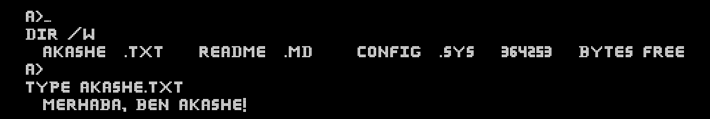

<h1 align="center">AkaShe - Full Stack Geliştirici</h1>

 

<h2>Hakkımda</h2>

C#, JavaScript, HTML ve CSS konusunda yetkin, hem web tabanlı hem de masaüstü uygulamalar geliştirebilen, oyun dosyaları (özellikle Minecraft) ile ilgilenen ve client-server mimarisine hakim, hevesli ve öğrenmeye açık bir full stack geliştiriciyim. Mesajlaşma uygulamaları, Discord botları gibi projeler üzerinde çalıştım ve bu alandaki yeteneklerimi sürekli geliştirmekteyim.

<h2>Yetenekler</h2>
<ul>
<li><strong>Programlama Dilleri:</strong> C#, JavaScript (Node.js)</li>
<li><strong>Web Teknolojileri:</strong> HTML5, CSS3, BootStrap, ASP.NET (Web Forms)</li>
<li><strong>Masaüstü Uygulama Geliştirme:</strong> Windows Forms</li>
<li><strong>Veritabanları:</strong> SQL Server, MySQL</li>
<li><strong>Oyun Geliştirme:</strong> Minecraft oyun dosyaları ile çalışma deneyimi</li>
<li><strong>Client-Server Mimarisi:</strong> Mesajlaşma uygulamaları ve Discord botu geliştirme tecrübesi</li>
</ul>

<h2>Projeler</h2>

<ul>
<li><strong>CleanAuthKit;</strong> <em>kullanıcıların giriş yapabilmesi, kayıt olabilmesi ve şifrelerini sıfırlayabilmesi için modern ve şık bir tasarım sunar. Bu proje, kullanıcı dostu bir arayüz sağlar ve responsive (mobil uyumlu) tasarım ile her cihazda mükemmel görünür. <a href="https://github.com/Akashe0106/CleanAuthKit">GitHub Linki</a></em></li>
</ul>

---

<h3 align="left">Benimle iletişime geçin:</h3>

<h3 align="left">Diller ve Araçlar:</h3>

